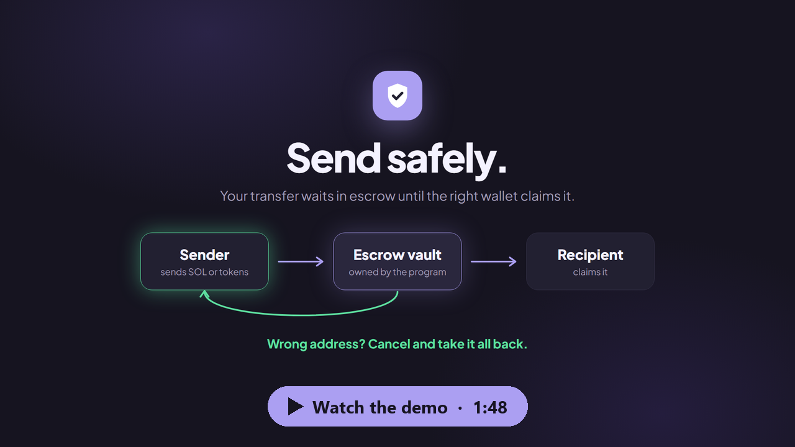

# Safe Send

**Send SOL and tokens on Solana that only arrive when the right wallet claims them. Wrong address? Take it back.**

[](docs/safe-send-demo.mp4)

| | |
| --- | --- |
| **Live app (Mainnet)** | https://www.safe-send.app |
| **Test app (Devnet)** | https://devnet.safe-send.app (Phantom → Settings → Developer settings → Testnet mode → Solana Devnet) |
| **Demo video** | [docs/safe-send-demo.mp4](docs/safe-send-demo.mp4) (1:48) |
| **Program** | [`EGLwJZkWybKNMeQQcmJ6HZYnCfTqWn2b7RQVRsPsQ1Zg`](https://explorer.solana.com/address/EGLwJZkWybKNMeQQcmJ6HZYnCfTqWn2b7RQVRsPsQ1Zg), same address on Mainnet and Devnet |
| **Verified build** | [OtterSec verification](https://verify.osec.io/status/EGLwJZkWybKNMeQQcmJ6HZYnCfTqWn2b7RQVRsPsQ1Zg): the Mainnet program is built from this repository |

## The problem

On Solana a transfer is final. One mistyped character, an old wallet, a clipboard swapped by malware, and the funds are gone for good: nobody can reverse it, and the sender only finds out when it is too late.

## The solution

Safe Send puts an escrow between "send" and "received". The funds move into an account owned by the program and wait there until the recipient claims them **from the exact wallet they were sent to**. If nobody claims them (wrong address, lost keys, changed mind), the sender cancels and gets everything back.

1. **Send.** Enter an amount and the recipient and sign with Phantom. Before you sign, the app checks that the recipient can pay the claim fee and shows exactly what the send costs: the amount, a refundable deposit (account rent) and the network fee. You get a link to share with the recipient.
2. **Claim.** The recipient opens Safe Send with their wallet, finds the transfer under **Receive** and clicks **Claim**. The program releases the funds only to that wallet.
3. **Or cancel.** Until it is claimed, the transfer is listed under **Pending** and the sender can **Cancel** at any time. The rent deposit goes back to the sender on claim or cancel.

Assets: SOL, any SPL token and Token-2022 tokens (including transfer-fee mints; tokens with a transfer hook are refused).

## How Solana is used

- **Custom on-chain program** (Rust, Anchor 0.30.1) in [`programs/safe_send/src/lib.rs`](programs/safe_send/src/lib.rs). Each transfer is an escrow PDA, and tokens sit in a vault token account owned by the program. Release goes only to the recipient, refund only to the sender.
- **SPL Token and Token-2022** through Anchor's `token_interface` and `transfer_checked`, with explicit handling of Token-2022 extensions (transfer fees, transfer hooks, permanent delegate).
- **Events** (`TransferSent`, `TransferClaimed`, `TransferCancelled`, `ConfigUpdated`) for indexers and webhooks.
- **Dynamic priority fees.** Each transaction is simulated to size its compute budget. Its price comes from `getRecentPrioritizationFees` on the accounts it writes, and it is capped so it never surprises the user.
- **Phantom** for connection (free sign-in message, no transaction) and signing.
- **Helius RPC.** On Mainnet the browser talks to a small Vercel function (`/api/rpc`) that keeps the RPC key server-side and forwards only the methods the app needs.
- **No IDL at runtime.** The web app builds instructions and decodes accounts by hand with `@solana/web3.js` and `@solana/spl-token` (Anchor discriminators plus the Borsh layout), so it stays small.

## Deployment

| | Mainnet | Devnet |
| --- | --- | --- |
| Program ID | `EGLwJZkWybKNMeQQcmJ6HZYnCfTqWn2b7RQVRsPsQ1Zg` | `EGLwJZkWybKNMeQQcmJ6HZYnCfTqWn2b7RQVRsPsQ1Zg` |
| Fee Config PDA `["config"]` | [`3PpDRvsx3xih7MCrr5A4ZGpo9tpwa9yhhWKqFfgPYYch`](https://explorer.solana.com/address/3PpDRvsx3xih7MCrr5A4ZGpo9tpwa9yhhWKqFfgPYYch) (fees off) | same address (fees off) |
| Upgrade authority / Config admin | `BVi2jbXTgmzFauGriBRFzxy8zugYiB4ssqwBTid8qcgD` | |
| Treasury | `HoLp715VudB6E9xE22oLtTUuvaddsCDyWkqrK5K75GAo` | |
| Web app | https://www.safe-send.app | https://devnet.safe-send.app |

Example transactions:

| Network | Send | Claim |
| --- | --- | --- |
| Mainnet | [`fkNGVF…tMdGqJT`](https://explorer.solana.com/tx/fkNGVFFDzDaDpXa67pfTnbKWKh9muFmHnmm49P5j665nmojp9BZSbbBx8WKexWexPT9nu8hitTLuTQJ6tMdGqJT) | [`3ULS5o…J6ex7nNtvvi`](https://explorer.solana.com/tx/3ULS5oT52Zp26o1wdeQQQU4P7XNr5YfqcJqonWSwJHnCqDPP1nqxJWm3masSMQhq7xaJ6q8K9UcTAJ6ex7nNtvvi) |
| Devnet (from the demo video) | [`Q9Be5Q…BubcLzn4LS`](https://explorer.solana.com/tx/Q9Be5QdPXz1utyWMXsvEH5NhHHT33SxS2DWhp9jAaqS5jxo2duyZTbGZXUVf1YAj7dz45w5JJXzoMBubcLzn4LS?cluster=devnet) | [`2U9Jt6…4zFdMP5xTSQ`](https://explorer.solana.com/tx/2U9Jt6SkG9Z48pbRhP4AGPcizWnwTxmjoX5nFqQuJ3BFMmeSTzygxYJNbszhq9Z3BH1MqNAZnYQMU4zFdMP5xTSQ?cluster=devnet) |

## Repository structure

```
safe_send/
├── programs/safe_send/src/lib.rs   on-chain program: instructions, accounts, events, errors
├── Anchor.toml, Cargo.toml         Anchor workspace (release profile opt-level = "s")
├── .cargo/config.toml              pins crates compatible with Solana's Rust toolchain
├── DEPLOY.md                       Mainnet launch checklist (verifiable build, deploy, verify, config)
├── docs/                           demo video and its poster
└── app/                            web app (Vite + TypeScript, deployed on Vercel)
    ├── index.html
    ├── src/
    │   ├── main.ts                 UI: Send / Receive / Pending, wallet switching, cost preview
    │   ├── wallet.ts               Phantom: connect with signature, follow account changes, sign and confirm
    │   ├── network.ts              Mainnet / Devnet selection, RPC URL, explorer links
    │   ├── lib/safeSend.ts         instruction builders, account decoding, mint inspection, events
    │   ├── lib/fees.ts             compute budget: simulation, priority price, caps
    │   └── style.css
    ├── api/rpc.ts                  Vercel function: RPC proxy for Mainnet (method and origin allowlist)
    ├── scripts/                    operator tools: fee config, escrow listing, Devnet/Mainnet smoke tests
    └── test/                       end-to-end tests on a local validator, and a UI test harness
```

## Run it locally

Prerequisites: **Node.js 24** for the web app; **Solana CLI 2.0 and Anchor 0.30.1** (Linux or WSL) for the program.

### Web app

```bash
cd app
npm install
npm run dev            # http://localhost:5173, Devnet by default, uses the program already deployed there
npm run build          # production build in app/dist
```

Open it with Phantom set to Devnet (Settings → Developer settings → Testnet mode → Solana Devnet) and some Devnet SOL from https://faucet.solana.com.

Configuration (build-time environment variables):

| Variable | Purpose |
| --- | --- |
| `VITE_CLUSTER` | `devnet` (default) or `mainnet-beta` |
| `VITE_RPC_URL` | any RPC URL, overrides everything (e.g. `http://127.0.0.1:8899` for a local validator) |
| `VITE_HELIUS_DEVNET_RPC_URL` | Devnet RPC used by the Devnet site (public by design, key restricted to our domains) |
| `HELIUS_MAINNET_RPC_URL` | **server-only**: Mainnet RPC used by `api/rpc.ts` |

To run the Mainnet build locally with the proxy:

```bash
HELIUS_MAINNET_RPC_URL=<rpc-url> node scripts/dev-rpc-proxy.ts            # serves /api/rpc on :8790
DEV_API_PROXY=http://127.0.0.1:8790 VITE_CLUSTER=mainnet-beta npx vite
```

On Vercel the project root is `app/`. The `main` branch is the Mainnet site and the `devnet` branch is the Devnet site.

### Program and tests

```bash
anchor build

# local validator with the program as upgradeable, owned by the throwaway test authority in app/test/fixtures
solana-test-validator --reset \
  --upgradeable-program EGLwJZkWybKNMeQQcmJ6HZYnCfTqWn2b7RQVRsPsQ1Zg target/deploy/safe_send.so 8igxrcwdyKwhBbvxs8WZmXGugvaMgDZ9Fu2w6TSyjnKC

cd app && npm test     # end-to-end: SOL, SPL, Token-2022, fees, config, RPC proxy
```

UI tests drive the real app with a fake Phantom that signs with test keypairs, against the same validator:

```bash
cd app && VITE_RPC_URL=http://127.0.0.1:8899 npx vite
# open http://localhost:5173/test/ui/harness.html, then in the browser console:
#   await harness.setup(2); location.reload();     and after the reload:   await runSuite()
```

### Deploy

```bash
solana program deploy target/deploy/safe_send.so --program-id target/deploy/safe_send-keypair.json --url devnet
cd app && node scripts/config.ts init <authority-keypair.json> --treasury <treasury-address> --rpc <rpc-url>
```

Mainnet uses a verifiable build and on-chain verification; every step is in [DEPLOY.md](DEPLOY.md).

## Program reference

| Instruction | Signer | Effect |
| --- | --- | --- |
| `send_sol(id, amount)` | sender | locks lamports in the escrow PDA `["escrow", sender, id]` |
| `claim_sol()` | recipient | lamports to the recipient, escrow rent back to the sender |
| `cancel_sol()` | sender | lamports and rent back to the sender |
| `send_token(id, amount)` | sender | locks tokens in the vault PDA `["vault", escrow]` (the app creates the recipient's token account in the same transaction) |
| `claim_token()` | recipient | tokens to the recipient, rent of escrow and vault back to the sender |
| `cancel_token()` | sender | tokens and rent back to the sender |
| `initialize_config(treasury)` | upgrade authority | creates the fee Config PDA `["config"]` (fees 0) |
| `update_config(...)` | Config admin | changes admin, treasury, `fee_bps`, `flat_fee_lamports` |

Checks: only the recipient can claim (`NotRecipient`), only the sender can cancel (`NotSender`), the asset must match (`WrongAsset`), no self-transfers (`SelfTransfer`) or zero amounts (`ZeroAmount`), Token-2022 transfer hooks are refused (`UnsupportedToken`), fees are capped (`FeeTooHigh`) and go only to the configured treasury (`WrongTreasury`). The app also refuses program addresses as recipients, since they cannot sign a claim.

## Design notes

- **Recipient without SOL.** Claiming is a transaction, so the recipient needs a little SOL. Before sending, the app checks the recipient's balance; if it is too low, the same transaction tops it up (~0.001 SOL for an empty wallet). The app says so before signing. The claim's priority fee is kept within what the recipient can pay. For tokens, the sender creates the recipient's token account at send time.
- **Protocol fee, off today.** The Config holds a percentage fee (`fee_bps`, capped at 1%) and a flat fee (capped at 0.01 SOL). Both are paid by the sender on top of the amount at send time and are not refunded on cancel. Both are 0 now; `node scripts/config.ts show | set …` manages them.
- **Token-2022.** For transfer-fee mints the escrow records what actually reached the vault, and the fee withheld in the vault is harvested before it closes. With a permanent delegate, the release moves whatever is left.
- **Wallets.** Several Phantom accounts can stay connected; the app follows the account selected in Phantom, and each one can be disconnected on its own.

## Limits and next steps

- The fee top-up for the recipient is not refundable if the address was wrong (~0.001 SOL). A relayer that pays the claim and is reimbursed from the escrow would remove it.
- Transfers have no expiry; the sender cancels by hand.
- The upgrade authority is a single key today; it moves to a Squads multisig before escrows hold significant value.
